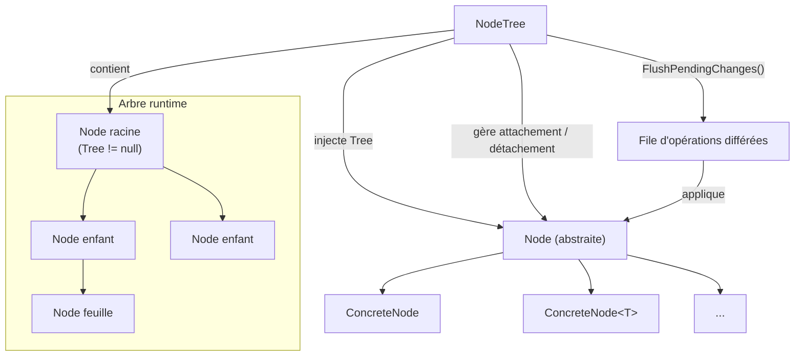
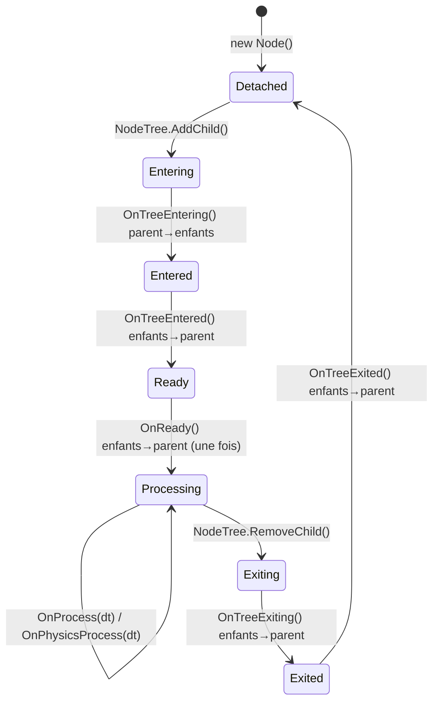

# Spécification — Node (Humble Engine)

## 1. Positionnement

Un `Node` est l'unité fondamentale de composition runtime dans Humble.  
Il ne représente pas un concept sérialisé — c'est une entité vivante dans un `NodeTree`.

Le terme `SceneTree` n'est pas utilisé. La structure runtime s'appelle `NodeTree`.

---

## 2. Hiérarchie de types



- `Node` est une **classe abstraite**. Elle porte toute la mécanique partagée (parent, enfants, cycle de vie, injection de `Tree`).
- Les génériques sont portés par les **nodes concrets**, pas par `Node` elle-même.
- L'intégration de libs tierces se fait par **composition**, pas par héritage.

---

## 3. Identité

- Chaque `Node` possède un `Guid` obligatoire comme identité runtime.
- Création sans id explicite : `Node()` génère automatiquement un `Guid`.
- Création avec id explicite : `Node(Guid id)` — réservé aux usages internes (tests, import déterministe).

---

## 4. Structure et appartenance

### 4.1 Invariants structurels

- Un `Node` a **un parent unique** (ou aucun s'il est racine).
- L'ordre des enfants est **conservé**.
- Un `Node` ne peut appartenir qu'à **un seul `NodeTree`** à la fois.
- Le transfert d'un `NodeTree` à un autre est **autorisé**, mais uniquement de façon **explicite** : le node doit d'abord être retiré de son arbre actuel via `RemoveChild`, puis ajouté au nouvel arbre. Le transfert implicite (sans retrait préalable) est interdit pour garantir la cohérence de l'ancien arbre.

### 4.2 Référence `Tree`

- `NodeTree` **injecte** la référence `Tree` directement sur chaque `Node` au moment de l'attachement.
- `NodeTree` **retire** cette référence au moment du détachement.
- `Tree` est `null` tant que le node n'est pas attaché à un `NodeTree`.

### 4.3 API structurelle

```csharp
node.AddChild(child);
node.AddChild(child, index);
node.RemoveChild(child);
```

- Hors `NodeTree` : modifications **immédiates**.
- Dans un `NodeTree` : modifications **différées** (file d'opérations).
- `NodeTree.FlushPendingChanges()` applique les opérations en attente.
- `NodeTree.Process(dt)` et `NodeTree.PhysicsProcess(dt)` appliquent d'abord les changements différés.

---

## 5. Cycle de vie



Les callbacks de cycle de vie sont des méthodes virtuelles sur `Node`, à override dans les nodes concrets.

| Callback | Déclenchement | Ordre |
|---|---|---|
| `OnTreeEntering` | Début de l'entrée dans le `NodeTree` | Parent → enfants |
| `OnTreeEntered` | Après l'entrée complète du sous-arbre | Enfants → parent |
| `OnReady` | Après `OnTreeEntered`, une seule fois par node | Enfants → parent |
| `OnTreeExiting` | Avant la sortie effective, `Tree` encore accessible | Enfants → parent |
| `OnTreeExited` | Après la sortie effective | Enfants → parent |
| `OnProcess(dt)` | Chaque tick logique | — |
| `OnPhysicsProcess(dt)` | Chaque tick physique | — |

**Règle de détachement** : pour un même parent, les enfants sont parcourus dans l'ordre **inverse** de la liste courante lors du détachement.

---

## 6. Membres exposés

Les nodes peuvent déclarer des **propriétés ou des champs** visibles depuis l'éditeur ou overridables depuis une `EmbeddedScene`. Les deux attributs sont des axes **indépendants** et peuvent se cumuler librement.

### 6.1 `[Exposed]`

```csharp
// Propriété calculée — visible dans l'inspecteur, pas de setter requis.
[Exposed]
public float TotalSpeed => BaseSpeed * Multiplier;

// Champ — également supporté.
[Exposed]
public int ExposedField = 7;
```

- Membre **visible dans l'inspecteur**, en lecture seule depuis l'éditeur.
- Non overridable depuis une `EmbeddedScene`.
- Compatible avec les propriétés calculées (sans setter) et les champs.
- Exige l'existence d'un getter pour les propriétés.

### 6.2 `[Overridable]`

```csharp
// Cas le plus courant : visible dans l'inspecteur ET overridable depuis une scène.
[Exposed]
[Overridable]
public string DisplayName { get; private set; }

// Cas write-only : overridable depuis une scène, mais invisible dans l'inspecteur.
// Utile pour les valeurs dont la lecture est volontairement masquée.
[Overridable]
public string Seed { private get; set; }

// Champ overridable — le modificateur d'accès n'a pas d'importance,
// le moteur écrit la valeur via réflexion.
[Overridable]
public float OverridableField;
```

- Membre **overridable depuis une `EmbeddedScene`** — le moteur écrit la valeur via réflexion à l'instanciation.
- Pour les propriétés : exige l'existence d'un setter (public ou privé).
- Pour les champs : toujours modifiable par réflexion, quel que soit le modificateur d'accès.
- Peut être cumulé avec `[Exposed]` pour rendre un membre à la fois visible et modifiable — c'est le cas le plus courant.
- Sans `[Exposed]`, le membre est modifiable depuis une scène mais invisible dans l'inspecteur (write-only).

**Règle de validation** : `[Overridable]` sur une propriété sans setter produit un diagnostic d'erreur au chargement.

---

## 7. Slots

Un `Slot` est un point d'insertion nommé et typé, exposé par un node, permettant l'injection de nodes enfants vers un node cible interne.

### 7.1 Déclaration

```csharp
public class InventoryNode : Control
{
    private Control _grid;

    [Slot(Description = "Points d'insertion pour les éléments de l'inventaire.")]
    public NodeSlot<InventoryEntry> Entries => GetSlot<InventoryEntry>(_grid);
}
```

- L'attribut `[Slot]` est posé sur la **propriété** `NodeSlot<T>`, pas sur le champ cible.
- `GetSlot<T>(targetNode)` résout le slot vers le node cible (avec cache).
- Injecter un node dans un slot revient à l'ajouter comme **enfant du node cible**.

### 7.2 `NodeSlot<T>`

- `T` contraint le type des nodes injectables.
- La cardinalité est déclarée sur le slot (voir `spec-scene.md` pour les cardinalités).
- L'accès depuis le code du node parent se fait via la propriété `NodeSlot<T>`.

---

## 8. Ownership et contrôle

- `NodeTree` centralise le contrôle de l'attachement et du détachement.
- La relation parent/enfants est gérée exclusivement via l'API `Node`, appliquée par `NodeTree`.

---

## 9. Invariants conceptuels

1. Un `Node` sans `NodeTree` a `Tree == null` — comportement documenté et attendu.
2. L'ordre des enfants est toujours conservé.
3. Un `Node` n'appartient qu'à un seul `NodeTree` à la fois. Le transfert entre trees est autorisé uniquement après retrait explicite de l'arbre actuel.
4. Le cycle de vie est toujours déclenché dans l'ordre défini, sans exception.
5. `[Exposed]` et `[Overridable]` sont deux axes indépendants — cumulables. `[Overridable]` sans `[Exposed]` produit un membre write-only (modifiable depuis une scène, invisible dans l'inspecteur).
6. Un slot injecte toujours comme enfant du node cible, jamais ailleurs.
