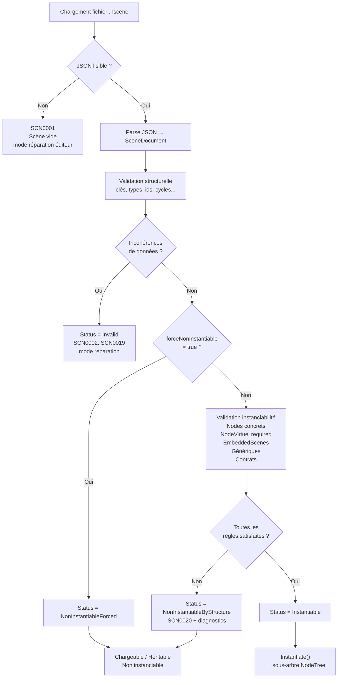
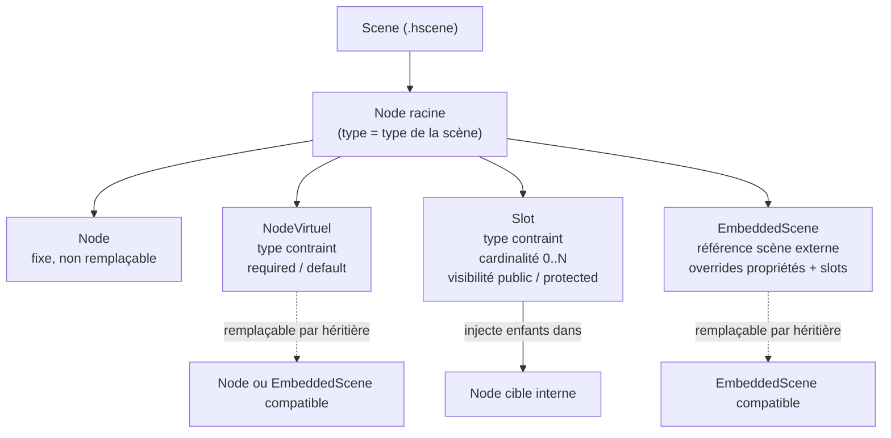
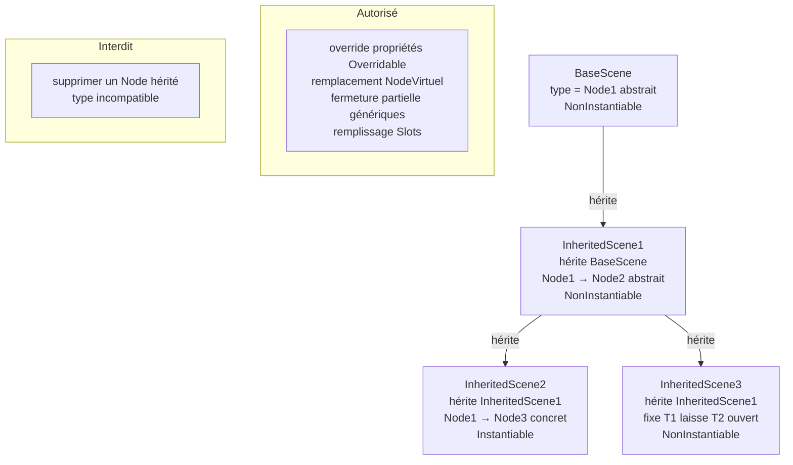
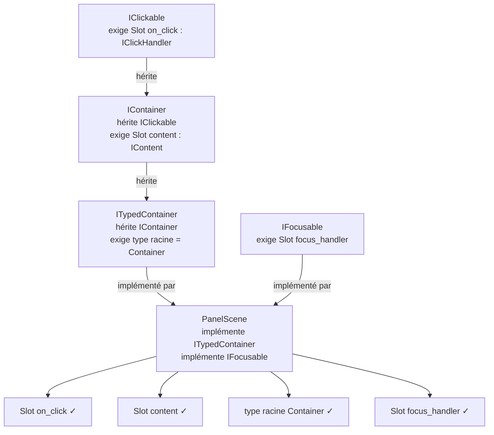

# Spécification — Scene (Humble Engine)

## 1. Positionnement

Une `Scene` est une **définition sérialisée** d'une arborescence de nodes, instanciable en sous-arbre dans un `NodeTree`.

Le runtime manipule un `NodeTree` — il ne dépend pas de l'existence des scènes.  
Les scènes sont des ressources sérialisées, chargées et validées avant instanciation.

---

## 2. Type d'une scène

**Le type d'une scène = le type de son node racine.**

- Une scène générique a le type générique de sa racine.
- Les paramètres génériques de la scène sont exactement ceux du type racine — pas de génériques propres à la scène.

```
Inventory<TItem>.hscene   →   type = InventoryNode<TItem>
Character.hscene          →   type = CharacterNode
```

---

## 3. Kinds de scène

### 3.1 `BaseScene`

- Ne dérive d'aucune autre scène.
- Déclare son propre type racine via un champ `root`.

### 3.2 `InheritedScene`

- Hérite d'une `BaseScene` ou d'une autre `InheritedScene`.
- Ne redéfinit pas de `root` — elle raffine la structure héritée via trois dictionnaires d'overrides.
- Le type racine doit être **compatible** avec celui de la scène parente (extension ou spécialisation valide).
- Peut fermer **partiellement** les génériques de la scène parente.

---

## 4. Instanciabilité

Chaque scène a un statut d'instanciabilité, déterminé au chargement en mémoire.



| Statut | Condition |
|---|---|
| `Instantiable` | Structure valide, tous les éléments concrets |
| `NonInstantiableForced` | `force_non_instantiable = true` |
| `NonInstantiableByStructure` | `force_non_instantiable = false` mais structure invalide |
| `Invalid` | Incohérence de données (JSON illisible, contraintes violées) |

**Règle** : seul le statut `Instantiable` permet l'instanciation runtime.  
`NonInstantiableForced` et `NonInstantiableByStructure` sont des états **valides** — la scène est chargeable et héritable.

### 4.1 Conditions d'instanciabilité

Pour qu'une scène soit `Instantiable` :

1. Tous les nodes ont un type **concret et non abstrait**.
2. Tous les `NodeVirtuel` marqués `required` ont été **fournis**.
3. Toutes les `EmbeddedScene` référencent des scènes **instanciables**.
4. Les génériques requis sont fermés ou fournis à l'instanciation.
5. Tous les **contrats déclarés** sont satisfaits.

---

## 5. Éléments structurels



Une scène contient quatre types d'éléments dans son arborescence :

| Élément | Rôle | Cardinalité | Visibilité |
|---|---|---|---|
| `Node` | Node concret, fixe | 1 | — |
| `NodeVirtuel` | Emplacement overridable par héritage | 1 | Héritières |
| `Slot` | Point d'insertion injectable | `0..N` | Public ou Protected |
| `EmbeddedScene` | Référence à une autre scène | 1 | — |

### 5.1 Node

- Node standard, type fixe, non remplaçable par héritage.
- Ne peut pas être **supprimé** dans une scène héritière.
- Ses propriétés `[Overridable]` peuvent être overridées dans une héritière via `set_properties`.
- Ses slots sont déclarés dans une section `slots` séparée des `children` — un slot n'est pas un enfant structurel du node.

### 5.2 NodeVirtuel

Analogue à une méthode `virtual` / `abstract` C#.

```
Character.hscene
└── CharacterNode (root)
    └── NodeVirtuel "controller" : CharacterController
        required = false
        default  = AICharacterController.hscene
```

**Attributs** :

- `type_constraint` — type contraint du node attendu. Peut être un paramètre générique de la scène racine.
- `required` — si `true`, la scène est `NonInstantiable` tant qu'aucune héritière ne le fournit. Analogue à `abstract`.
- `default` — valeur par défaut optionnelle : un `Node` concret ou une `EmbeddedScene` compatible.

**Règles d'override** :

- Une scène héritière peut remplacer un `NodeVirtuel` par un `Node` concret compatible **ou** une `EmbeddedScene` compatible, via `replace_virtuals`.
- Le type remplaçant doit respecter la contrainte de type du `NodeVirtuel`.
- Un `NodeVirtuel` sans `default` et non `required` laisse l'emplacement vide à l'instanciation.

**Visibilité** : accessible uniquement par la scène elle-même et ses héritières (analogue à `protected`).

### 5.3 Slot

Un `Slot` est un point d'insertion nommé et typé. Injecter dans un slot revient à ajouter les nodes comme **enfants du node cible** pointé par le slot. La cardinalité est toujours `0..N` — un slot n'impose aucune limite sur le nombre d'éléments injectés.

Les slots sont déclarés dans une section `slots` dédiée sur le node qui les expose — pas dans ses `children`. C'est cohérent avec le modèle C# où `[Slot]` est une propriété du node.

**Attributs** :

- `accepted_type` — type contraint des éléments injectables.
- `target_node_id` — id du node interne vers lequel les enfants sont effectivement ajoutés.
- `visibility` — `public` ou `protected`.

**Visibilité** :

| Visibilité | Assignable par |
|---|---|
| `public` | Scène englobante **et** scènes héritières |
| `protected` | Scènes héritières uniquement |

### 5.4 EmbeddedScene

Référence à une scène externe, utilisée là où un node est attendu dans l'arborescence. Le type de la scène référencée est vérifié par le système de types C# au moment de la validation — aucune contrainte de type supplémentaire n'est nécessaire dans le fichier JSON.

**Règles** :

- Elle peut override les propriétés `[Overridable]` de la scène référencée.
- Elle peut remplir les `Slot` publics de la scène référencée.
- Dans une scène `NonInstantiable`, une `EmbeddedScene` peut pointer vers une scène `NonInstantiable`. Une héritière instanciable doit la remplacer par une scène instanciable compatible.

---

## 6. Héritage de scène



### 6.1 Ce qui est autorisé dans une `InheritedScene`

- Override des propriétés `[Overridable]` de nodes hérités via `set_properties`.
- Remplacement d'un `NodeVirtuel` hérité par un node concret ou une `EmbeddedScene` compatible via `replace_virtuals`.
- Remplacement d'une `EmbeddedScene` héritée par une scène compatible.
- Fermeture partielle des génériques de la scène parente.
- Remplissage des `Slot` hérités (selon leur visibilité) via `fill_slots`.
- Raffinement du type racine vers un type plus spécialisé.

### 6.2 Ce qui est interdit

- Supprimer un `Node` hérité.
- Remplacer un node hérité par un type incompatible.
- Modifier la contrainte de type d'un `Slot` hérité vers un type moins contraint.

### 6.3 Raffinement de type

Le raffinement est **monotone** — on ne peut qu'aller vers un type plus spécialisé, jamais vers un type incompatible.

### 6.4 Génériques et héritage

Une scène héritière peut fixer certains paramètres génériques et en laisser d'autres ouverts, et sur-contraindre un paramètre générique. Les `generic_bindings` vivent uniquement sur les nodes et les `EmbeddedScene` — le node racine porte naturellement les bindings de la scène entière.

```csharp
// Équivalent C# :
public class Scene1<T1, T2> where T1 : IDisposable { }
public class Scene2<T1, T2> : Scene1<T1, T2> where T1 : IDisposable, IReadOnlyList<T2> { }
```

---

## 7. Contrats de scène



Un contrat de scène est l'équivalent d'une **interface C#** appliquée aux scènes.

### 7.1 Ce qu'un contrat peut exiger

- Un **type racine** minimal.
- Des **Slots nommés et typés**.

### 7.2 Héritage de contrats

- Un contrat peut **hériter d'un ou plusieurs autres contrats**.
- Une scène qui implémente un contrat satisfait aussi tous ses contrats parents.

### 7.3 Implémentation multiple

- Une scène peut implémenter **plusieurs contrats**.
- La validation vérifie chaque contrat indépendamment.

---

## 8. Sérialisation JSON

### 8.1 Conventions

- Format : JSON, **snake_case**, en **anglais**.
- L'imbrication JSON d'une `BaseScene` reproduit l'imbrication de l'arbre instancié.
- Les propriétés de nodes sont portées par la clé `properties`.
- Les slots sont portés par la clé `slots` — une map indexée par id de slot, séparée des `children`.
- Les `generic_bindings` vivent uniquement sur les nodes et les `EmbeddedScene`, jamais au niveau racine du document.

### 8.2 Schéma — BaseScene

```json
{
  "schema_version": 1,
  "scene_kind": "base",
  "implements": [],
  "force_non_instantiable": false,
  "root": {}
}
```

### 8.3 Schéma — InheritedScene

```json
{
  "schema_version": 1,
  "scene_kind": "inherited",
  "extends_scene": "res://characters/character.hscene",
  "implements": [],
  "force_non_instantiable": false,
  "replace_virtuals": {},
  "fill_slots": {},
  "set_properties": {}
}
```

### 8.4 Schéma — Node

```json
{
  "kind": "node",
  "id": "player",
  "type": "Game.PlayerNode`1",
  "generic_bindings": { "TStats": "Game.PlayerStats" },
  "properties": { "speed": 4.5 },
  "slots": {
    "abilities": {
      "accepted_type": "Game.IAbility",
      "target_node_id": "abilities_container",
      "visibility": "public",
      "items": []
    }
  },
  "children": []
}
```

### 8.5 Schéma — NodeVirtuel

```json
{
  "kind": "virtual_node",
  "id": "controller",
  "type_constraint": "Game.CharacterController",
  "required": true,
  "default": null
}
```

### 8.6 Schéma — EmbeddedScene

```json
{
  "kind": "embedded_scene",
  "id": "weapon",
  "scene_path": "res://scenes/sword.hscene",
  "generic_bindings": { "TDamage": "Game.SlashDamage" },
  "overrides": {
    "properties": { "display_name": "Épée longue" },
    "slots": {
      "effects": { "items": [] }
    }
  }
}
```

### 8.7 Schéma — Overrides d'une InheritedScene

Les overrides sont exprimés via trois dictionnaires distincts, chacun indexé par l'id de l'élément ciblé. Cette structure garantit qu'un même `target_id` ne peut apparaître qu'une seule fois par type d'override.

**`replace_virtuals`** — remplace des `NodeVirtuel` par des nodes concrets ou des `EmbeddedScene`. La clé est l'id du `NodeVirtuel` à remplacer, la valeur est l'élément remplaçant :

```json
"replace_virtuals": {
  "controller": {
    "kind": "embedded_scene",
    "id": "player_controller",
    "scene_path": "res://controllers/player_controller.hscene",
    "generic_bindings": {},
    "overrides": { "properties": {}, "slots": {} }
  }
}
```

**`fill_slots`** — injecte des éléments dans des slots existants. La clé est l'id du slot cible, la valeur porte la liste des éléments à injecter :

```json
"fill_slots": {
  "abilities": {
    "items": [
      {
        "kind": "embedded_scene",
        "id": "dash_ability",
        "scene_path": "res://abilities/dash.hscene",
        "generic_bindings": {},
        "overrides": { "properties": {}, "slots": {} }
      }
    ]
  }
}
```

**`set_properties`** — modifie des propriétés `[Overridable]` sur des nodes existants. La clé est l'id du node ciblé, la valeur est un dictionnaire de propriétés à modifier. Plusieurs nodes peuvent être ciblés en parallèle :

```json
"set_properties": {
  "player": { "speed": 6.0, "display_name": "Hero" },
  "camera": { "fov": 90 }
}
```

---

## 9. Diagnostics de validation

| Code | Description | Sévérité |
|---|---|---|
| `SCN0001` | JSON illisible (parse impossible) | Error |
| `SCN0002` | Clé JSON obligatoire manquante | Error |
| `SCN0003` | Valeur JSON de type inattendu | Error |
| `SCN0004` | `scene_kind` invalide | Error |
| `SCN0005` | `extends_scene` manquant pour une scène héritée | Error |
| `SCN0006` | Type racine incompatible avec la scène parente | Error |
| `SCN0007` | Node hérité supprimé (interdit) | Error |
| `SCN0008` | Type de node abstrait non concrétisé dans une scène instanciable | Error |
| `SCN0009` | `EmbeddedScene` non instanciable non remplacée dans une scène instanciable | Error |
| `SCN0010` | Incompatibilité de type sur `EmbeddedScene` | Error |
| `SCN0011` | Contraintes génériques non satisfaites | Error |
| `SCN0012` | Fermeture générique requise manquante à l'instanciation | Error |
| `SCN0013` | Override de propriété inconnue ou non `[Overridable]` | Error |
| `SCN0014` | Valeur d'override invalide pour le type de la propriété | Error |
| `SCN0015` | `id` dupliqué dans la scène | Error |
| `SCN0016` | Scène référencée introuvable (`scene_path`) | Error |
| `SCN0017` | Référence cyclique de scènes détectée | Error |
| `SCN0018` | Élément sans `kind` valide | Error |
| `SCN0019` | Statut `NonInstantiableByStructure` (informatif éditeur) | Info |
| `SCN0020` | `NodeVirtuel` required non fourni dans une scène instanciable | Error |
| `SCN0021` | Contrat de scène non satisfait | Error |
| `SCN0022` | Override interdit (visibilité `protected` depuis scène englobante) | Error |
| `SCN0023` | `target_id` d'un override introuvable dans la scène parente | Error |

### 9.1 API de chargement

```csharp
public sealed record SceneDiagnostic(
    string Code,
    SceneDiagnosticSeverity Severity,
    string Message,
    string? JsonPath = null,
    string? ElementId = null,
    string? Suggestion = null,
    bool CanAutoRepair = false);

public sealed record SceneLoadResult(
    SceneDocument? Document,
    SceneInstantiabilityStatus Status,
    IReadOnlyList<SceneDiagnostic> Diagnostics);

SceneLoadResult LoadForEditor(string scenePath);
SceneLoadResult LoadForRuntime(string scenePath);
SceneInstance Instantiate(SceneLoadResult loadResult, GenericTypeArguments? genericArguments = null);
```

---

## 10. Modèle mémoire et réparation

- Le modèle mémoire de scène est **unique et mutable**.
- Les corrections sont appliquées sous forme d'**actions rejouables** (command log).
- En cas de JSON totalement illisible : l'éditeur ouvre une scène vide, ajoute `SCN0001`, reconstruction progressive.
- V1 : log en mémoire uniquement. V2 : persistance via `.hrepair`.

---

## 11. Invariants conceptuels

1. Le type d'une scène = le type de son node racine.
2. L'héritage de scène préserve la compatibilité de type (monotone).
3. Un node hérité ne peut jamais être supprimé.
4. Le raffinement de type est monotone — jamais vers un type incompatible.
5. Les `EmbeddedScene` respectent la compatibilité de type C# (variance comprise).
6. Le JSON d'une `BaseScene` est structurellement isomorphe à l'arbre instancié.
7. Le JSON d'une `InheritedScene` exprime ses modifications via trois dictionnaires (`replace_virtuals`, `fill_slots`, `set_properties`) — un même `target_id` ne peut apparaître qu'une seule fois par dictionnaire.
8. Un `Slot` public est assignable par la scène englobante et les héritières.
9. Un `Slot` protected est assignable uniquement par les héritières.
10. Injecter dans un slot = ajouter comme enfant du node cible du slot.
11. Un `NodeVirtuel` est visible uniquement par la scène et ses héritières.
12. Les `generic_bindings` vivent sur les nodes et les `EmbeddedScene` — jamais au niveau racine du document.
13. Les slots sont déclarés dans une section `slots` dédiée sur le node — pas dans ses `children`.